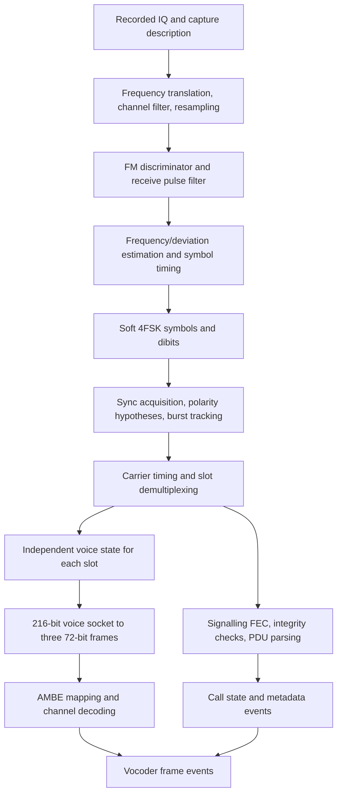

# DMR receiver implementation plan

Build a receiver that reads recorded complex IQ, isolates one DMR channel, recovers both TDMA slots, and exports ordered vocoder frames together with validated DMR metadata. Start with conventional repeater downlink recordings, then extend to conventional mobile uplink and direct mode. Live SDR input and trunk tracking are later extensions.

This is an implementation plan, not an implemented receiver. The workspace currently contains three reference PDFs and no existing application. The first-release scope follows the selected priority: **recorded IQ, conventional DMR first**.

## 1. Deliverables and scope

The first release should provide a reusable decoding library and an offline command-line program with:

- Explicit IQ format, sample rate, channel offset, and optional capture timestamp inputs.
- Independent decoding of both slots on one RF carrier.
- Raw 72-bit channel-coded voice frames and, for the supported AMBE profile, recovered 49-bit vocoder payloads.
- Colour code, source/destination IDs, group/private call type, service options, call/transmission boundaries, and raw signalling PDUs.
- Quality, correction, erasure, unknown-field, and synchronization-loss reporting.
- Deterministic replay and diagnostic exports at IQ, symbol, burst, and PDU boundaries.

The minimum release must handle voice LC headers, voice A-F superframes, embedded LC, terminators, CACH/Short LC, and conventional CSBK messages. Recognize data headers and data-burst types and retain their raw payloads. Complete packet-data reassembly is a subsequent milestone; it is not required to extract voice or basic call metadata.

PCM audio synthesis, vendor-specific protocols, multi-channel scanning, and Tier III trunk following are outside the first release. The initial privacy-decryption exclusion has been extended by the requested known-key DMRA ARC4 adapter; see [docs/PRIVACY.md](docs/PRIVACY.md) for its supported PI profile, validation and limits. Other privacy methods remain deferred. Preserve opaque payloads and identifiers so extensions do not require redesigning the receiver.

Code must be ready to live-streaming IQ decoding. 

Available sample of recorder IQ of encrypted DMR (dmr_test.wav). 

## 2. Reference baseline

Use these exact editions as the initial specification baseline; do not silently mix revision-specific fields.

| Reference | Relevant material | Use |
|---|---|---|
| [ETSI TS 102 361-1 V2.1.1](ts_10236101v020101p.pdf), April 2012 | Clauses 4.2-4.5, 5.1.2, 6-10; Annexes B-E | RF, timing, burst layouts, signalling, coding, checksums, bit ordering |
| [ETSI TS 102 361-2 V2.2.1](ts_10236102v020201p.pdf), July 2013 | Clause 5; clauses 7.1-7.2; Annex B | Conventional voice services, addresses, service options, opcode meanings |
| [Local Part 3 preview](ETSI-TS-102-361-3-V1-3-1-2017-10-.pdf), V1.3.1 | Only 13 PDF pages; substantive packet-data sections are absent | Orientation only |
| [Full ETSI TS 102 361-3 V1.3.1](https://www.etsi.org/deliver/etsi_ts/102300_102399/10236103/01.03.01_60/ts_10236103v010301p.pdf), October 2017 | Clauses 5-7 | Later IP and short-data interpretation; official 57-page document |

Part 1 defines a generic vocoder socket, not a complete AMBE codec implementation. For the AMBE adapter, use independently verified codec documentation or a pinned implementation reference. The [DSD DMR frame mapping](https://github.com/szechyjs/dsd/blob/master/src/dmr_voice.c) and [mapping tables](https://github.com/szechyjs/dsd/blob/master/include/dmr_const.h) provide an implementation cross-check; [mbelib's AMBE 3600x2450 processing](https://github.com/szechyjs/mbelib/blob/master/ambe3600x2450.c) provides the channel-decoding sequence and 49-bit output convention. Pin revisions and record provenance before adopting code or golden vectors.

Important specification limits: these supplied editions reserve or leave privacy mechanisms undefined. Report raw PI/privacy fields and evidence; do not infer an algorithm, key ID, or decryptability from them alone. Tier III requires Part 4 and an additional control-channel design.

## 3. End-to-end architecture



Keep DSP, burst framing, protocol decoding, and codec adaptation independently testable. Every stage must support incremental input, retain state across arbitrary buffer boundaries, and carry sample-position provenance. Build bitstream-to-output decoding before integrating IQ, so RF faults and bit-order faults can be isolated.

## 4. IQ to soft symbols

### Input and channel conditioning

1. Initially accept interleaved little-endian `cf32` and `cs16`; add unsigned 8-bit IQ when a fixture needs it. Require sample rate and sample-format declarations. Define I/Q ordering, integer scaling, and conjugation explicitly.
2. Read bounded chunks; reject malformed/truncated sample pairs. Represent known capture gaps as discontinuities rather than silently concatenating them.
3. Translate the selected channel to baseband with a phase-continuous NCO. Begin with a configured channel offset; automatic channel discovery is optional.
4. Apply an anti-alias channel filter and rational resampler. A useful initial processing rate is **48 ksample/s**, or 10 samples per DMR symbol. This is a receiver design choice, not a DMR requirement.
5. Design the complex channel filter around the occupied FM spectrum, allowed residual tuning error, and adjacent-channel rejection. The 12.5 kHz channel spacing is not a sufficient filter specification. Keep this filter separate from the discriminator-domain pulse filter.
6. Measure clipping and relative power. Make IQ DC correction configurable: blindly subtracting a mean can affect a signal centred near DC. Calibrated RSSI requires receiver calibration; label an uncalibrated measurement as relative power.

### Discriminator, filtering, and timing

Compute a phase-difference discriminator:

```text
f[n] = Fs / (2*pi) * arg(x[n] * conjugate(x[n-1]))
```

Preserve the previous complex sample between chunks. At very low signal power, flag unreliable observations and freeze or limit loop updates. Remove coarse frequency error before narrowing the channel excessively; use the discriminator for residual frequency tracking.

Use a receive square-root raised-cosine pulse filter consistent with Part 1 clause 10.2.2.2. Its 1920-2880 Hz transition corresponds to roll-off 0.2 at 4800 symbols/s. Account for actual filter gain and group delay. Start timing recovery with an interpolating early/late or Gardner loop and tune it against synthetic and recorded DMR; the estimator and loop bandwidth are implementation choices.

Estimate frequency offset and deviation scale using known sync symbols, then track slowly using reliable symbol decisions. Do not estimate frequency offset simply from the average of a short, potentially unbalanced payload. Jointly retain timing, frequency, and polarity candidates during acquisition where needed.

DMR uses 4800 symbols/s and two bits per symbol. Apply the explicit mapping from Part 1 table 10.3:

| Nominal deviation | Symbol | Dibit, bit 1 first |
|---:|---:|---|
| +1944 Hz | +3 | `01` |
| +648 Hz | +1 | `00` |
| -648 Hz | -1 | `10` |
| -1944 Hz | -3 | `11` |

Export each symbol with a timestamp, hard decision, and four candidate costs or likelihoods. Preserve soft information for synchronization and later FEC improvements. There is no generic differential-bit decoding stage in this chain.

## 5. Synchronization, timing, and burst recovery

Use Part 1 table 9.2 as the checked source of sync constants. Recognize BS voice/data, MS voice/data, TDMA direct slot-specific voice/data, and standalone reverse-channel sync. A sync field is 48 bits / 24 symbols. Do not treat reserved sync as a normal supported burst.

Acquisition should correlate against expected soft symbols, retain preceding samples in a ring buffer, and recover the entire burst around the central sync. Preserve at least the preceding 54 payload symbols plus filter and acquisition margin.

**Resolve polarity with protocol evidence.** Voice and data sync patterns are symbol-wise complements. A discriminator sign inversion can therefore interchange them. Keep competing hypotheses until slot-type decoding, validated LC/CSBK, EMB consistency, and subsequent timing provide enough evidence. A strong sync peak alone cannot always resolve voice versus inverted data.

Timing invariants, from Part 1 clauses 4.2 and 5.1.2:

| Unit | Size/duration | Receiver implication |
|---|---|---|
| Burst content | 264 bits = 132 symbols = 27.5 ms | Extract independently of CACH/guard interval |
| Slot interval | 30 ms = 144 symbol periods | Includes 2.5 ms outside the content |
| Two-slot frame | 60 ms | Same logical slot repeats every 60 ms |
| Voice superframe | Six same-slot bursts A-F = 360 ms | Track phase separately for each slot |
| BS CACH | 24 bits = 12 symbols = 2.5 ms | Common carrier-level stream between outbound bursts |

Implement `SEARCH -> CANDIDATE -> LOCKED -> HOLDOVER -> SEARCH`, with measurable scores and configurable loss thresholds. Burst A has voice sync; B-F contain embedded signalling. Continue recovering B-F at predicted boundaries rather than demanding a sync word in every burst. Do not assume the two slots have aligned A-F phases.

For repeater downlink, deinterleave CACH, decode TACT, and associate the TC slot indication with the correct adjacent burst using the specification's timing convention. Test this association explicitly to avoid swapping slots. Assemble Short LC on the common CACH stream across consecutive physical slots; it does not belong to one voice slot's A-F state.

For uplink and ordinary direct mode, the gap is guard time, not CACH. MS sync alone does not establish an absolute slot number. Preserve `slot=unknown` or a relative track until timing evidence establishes numbering. Slot-specific TDMA direct sync supplies additional evidence.

On a missing burst, advance predicted phase only while timing remains credible and emit erasures. On a sample gap, reset affected DSP and framing state and terminate or invalidate partial reassemblies. Do not bridge uncertain timing with invented payloads.

## 6. Burst parsing and error correction

Define one canonical bit convention: `burst_bits[0]` is the first transmitted bit, with bit 1 preceding bit 0 within each dibit. Use half-open array ranges in code and tests.

```text
Voice A:    voice[108] | sync[48]                  | voice[108]
Voice B-F:  voice[108] | EMB[8] | embedded[32] | EMB[8] | voice[108]
Data:       info[98] | SLOT[10] | centre[48] | SLOT[10] | info[98]
```

The data centre can carry sync or allowed embedded reverse-channel signalling. Implement classification from timing context and validated fields, not only a central sync match.

| Field/message | Decode path | Integrity/evidence |
|---|---|---|
| SLOT | Join 10+10 bits; Golay (20,8) | Colour code and data type; bounded correction distance |
| EMB | Join 8+8 bits; QR (16,7,6) | Colour code, raw PI, LCSS; bounded correction distance |
| CACH TACT | CACH deinterleave; Hamming (7,4) | Access type, TC, LCSS; contextual consistency |
| Voice LC header / terminator | Data deinterleave; BPTC (196,96) | Unmask parity and validate RS (12,9), yielding 72-bit LC |
| Embedded Full LC | LCSS-guided four-fragment assembly; 128-bit variable BPTC | Hamming (16,11,4) rows, column parity, 5-bit checksum |
| CACH Short LC | Four-fragment common-stream assembly; variable BPTC | Hamming (17,12,3), column parity, CRC-8 |
| CSBK / data header / PI header envelope | BPTC (196,96) | Applicable masked CRC-16; semantics dispatched separately |
| Rate 1/2 data | BPTC (196,96) | Packet/block checks as applicable |
| Rate 3/4 data | Specified deinterleaver and trellis decoder | Packet/block checks as applicable |
| Rate 1 data | Specified bit extraction | Packet/block checks as applicable |

Implement coding matrices, interleavers, and checks from Part 1 Annex B and on-air ordering from Annex E. In particular, the voice LC's 24 parity bits use **Reed-Solomon**, despite some figures using the generic label CRC. Undo the message-specific mask after BPTC decoding and before the corresponding integrity check. The embedded LC 5-bit check is an octet sum modulo 31, not a CRC-5.

Embedded LC assembly must follow LCSS and superframe context. Do not hardcode B-E as the only possible fragment positions: reverse-channel signalling can affect placement. Reject incomplete, mixed-slot, or cross-superframe assemblies. Preserve unknown FID/opcode payloads without interpreting them as standard group voice.

Every decoder returns raw bits, decoded bits, correction counts, residual parity/syndrome status, applicable integrity result, and confidence. Correction counts are estimates, not measured BER. A codeword or weak checksum match alone does not establish that a message is genuine.

## 7. Voice payload to vocoder frames

For an established voice burst, concatenate `burst_bits[0:108]` and `burst_bits[156:264]` into a 216-bit socket in transmission order. For the chosen 20 ms AMBE profile, split it into three consecutive 72-bit frames. The middle frame spans the two sides of the centre field.

Produce two distinct representations:

| Representation | Size | Meaning |
|---|---:|---|
| `dmr_voice72_air` | 72 bits / 9 bytes | Received channel-coded frame in documented air order; retain for replay and codec adapters |
| `ambe2450_payload` | 49 bits / 7 packed bytes | Codec parameter payload after profile-specific channel decoding; seven unused low bits in the final byte are zero |

Pack bits MSB first and include a representation/profile version. Do not label nine received bytes as an already corrected vocoder payload.

The AMBE adapter must explicitly map the 72 bits into its codec codeword layout, correct the first protected block, undo the codec's pseudo-random modulation using the recovered seed, correct the remaining protected block, and collect 49 payload bits in the selected codec interface's order. Use independent golden vectors for the mapping and correction order. Keep these operations separate from DMR signalling BPTC and from privacy handling. The implementation references linked above support this adapter design.

Emit three frames per valid voice burst, with 20 ms relative playout spacing: 18 frames per complete A-F superframe and 50 frames/s for a continuously active slot. Distinguish RF sample time from reconstructed speech playout time; the recording does not reveal the speaker's original absolute capture time.

Preserve raw frames when privacy is indicated or the codec profile is unsupported. Expose unknown/suspect/unrecoverable status instead of claiming usable clear vocoder data. There is no universal end-to-end voice CRC, and unprotected bits can still be wrong after successful protected-block correction. For missing voice during a credible active call, emit explicit erasure records, not fabricated silence bits.

## 8. Metadata and output contract

Maintain separate per-slot transmission state: `IDLE`, `HEADER_SEEN`, `VOICE_ACTIVE`, `ENDING`, and `LOST`. Open a provisional session on late entry even before IDs are available. Update it when validated embedded LC arrives. A terminator ends a transmission/speech item; grouping several push-to-talk transmissions into one conversation is a separate optional policy.

| Metadata | Source/handling |
|---|---|
| Carrier frequency, capture time, sample index | Input description and DSP position tracking; nullable where unavailable |
| BS/MS/direct mode, slot, A-F phase | Sync, CACH, timing state; retain uncertainty |
| Colour code | Validated SLOT or EMB; do not assume it is an address or globally unique site ID |
| Source ID and destination ID | Validated Full LC or relevant control/data PDU; 24-bit raw IDs |
| Group/private call | Standard FID plus FLCO; interpret destination as group or unit accordingly |
| Emergency, broadcast, OVCM, priority | Part 2 service options, alongside raw octet |
| Privacy/protect information | Separate raw fields with provenance; no guessed encryption algorithm |
| Activity and destination hash | Short LC; an 8-bit hash is not a full destination ID |
| Data/control type, FID, opcode | Decoded PDU; preserve unknown/vendor values |
| Signal and decoding quality | Relative power, residual frequency error, sync score, FEC and integrity results |

Only validated metadata may update trusted call identity. Emit invalid PDUs as diagnostics. Never carry a previous caller's IDs into a new unidentified transmission. Store field provenance, observation time, and whether a value is directly decoded or inferred. IDs missing at late entry remain null; later metadata updates refer to the same session ID.

Use versioned JSON Lines initially, with one ordered event stream containing `capture_info`, `sync_acquired`, `burst`, `pdu`, `call_start`, `call_update`, `vocoder_frame`, `erasure`, `call_end`, and `sync_lost`. Large raw diagnostics may be opt-in. Each voice event should include:

```text
schema_version, capture_id, channel_id, session_id, burst_id
rf_sample_index, rf_time_seconds, slot, superframe_phase
frame_index_in_burst, frame_sequence, playout_offset_ms, duration_ms
codec_profile, representation, bit_length, payload_hex
metadata_revision, privacy_status
quality: {sync_score, corrected_bits, channel_decode_status, erasure}
```

Define capture-relative time from the original sample rate and compensate for filter/resampler delay. When chronology across output paths differs because LC requires reassembly, include both the source sample position and event-emission sequence. Close sessions at EOF with an explicit reason rather than presenting EOF as an over-air terminator.

## 9. Implementation milestones

| Milestone | Work | Exit criterion |
|---|---|---|
| M0: Contracts and fixtures | Freeze supported IQ formats, bit conventions, event schema, specification editions, and AMBE profile. Obtain at least one independently labelled clean IQ recording and one codec vector. | A fixture manifest records expected slots, IDs, burst/frame counts, provenance, and file hashes. Missing reference captures are an explicit validation dependency. |
| M1: Bit-level core | Implement interleavers, FEC, masks/checks, burst layouts, and voice socket extraction. Accept pre-aligned hard/soft bursts. | Annex D/E applicable patterns and independently derived vectors agree bit-for-bit; bounded-error cases behave correctly. |
| M2: Protocol and vocoder outputs | Add independent slot state, Full/embedded/Short LC, conventional CSBK, session events, and AMBE adapter. | Known burst streams produce exact metadata and 72-/49-bit outputs, including late entry and both slots. |
| M3: IQ front end | Add channel conditioning, discriminator, pulse filter, timing/frequency tracking, and soft symbols. | Noiseless independently generated IQ recovers exact dibits across chunk sizes, channel offsets, timing phases, and declared sample formats. |
| M4: End-to-end acquisition | Connect sync/polarity hypotheses, CACH, A-F tracking, loss recovery, and output writers. | Clean repeater recordings decode both slots with expected frames/metadata; inverted IQ and mid-call starts also pass. **First useful release.** |
| M5: Robustness and conventional modes | Characterize noise/drift/fades; add validated MS uplink and direct-mode handling. | Published performance curves, bounded memory, repeatable reacquisition, and no cross-slot or cross-call identity leakage. |
| M6: Packet data | Add rate 1/2, 3/4, and 1 block handling, confirmed/unconfirmed reassembly, CRC-9/CRC-32, padding, sequence/retry rules, and Part 3 interpretation. | Known packets reconstruct exactly; incomplete/corrupt packets remain explicitly incomplete/invalid. |

Live SDR adapters, multiple channels, vendor extensions, and Tier III control-channel following follow these milestones as separate projects. Do not make them prerequisites for M4.

Suggested module boundaries: `input`, `dsp`, `sync`, `burst`, `fec`, `protocol`, `vocoder`, `state`, `output`, `fixtures`, and `tests`. Keep the plan language-independent until integration constraints are known. A small numerical reference harness is useful even if the production library is compiled; avoid committing to two full implementations before profiling.

## 10. Validation and acceptance

Build a deterministic signal/bit fixture generator with known payloads, DMR pulse shaping, and controllable impairments. Validate it against specification patterns and an independent decoder or transmitter capture; an encoder/decoder round trip alone can hide shared mistakes.

Required checks:

1. **Bit/FEC:** all small-code input words where practical; correction within documented capability; over-limit error samples; matrix/interleaver ordering; different LC masks; checksum failure paths. Do not assume all excessive errors are detectable.
2. **Framing:** both simultaneous slots with different A-F phases; middle vocoder frame crossing sync; CACH-to-slot association; reverse-channel insertion; headers/terminators; idle/data transitions; unknown opcodes.
3. **Continuity:** start mid-call; missing A/B-F bursts; missing LC fragments; sample discontinuities; partial final burst; random read chunk boundaries. Recoverable samples must produce identical outputs regardless of chunking.
4. **RF:** AWGN sweep with an explicit SNR definition, residual frequency error, sampling-clock drift, random timing phase, level changes, I/Q conjugation, clipping, fades, adjacent-channel interference, and optional multipath. Keep frequency offset and sample-clock error independently configurable.
5. **Metadata:** exact IDs and service flags on clean labelled fixtures; no stale caller identity; unknown slots stay unknown; invalid checks cannot establish trusted identity; destination hashes stay labelled as hashes.
6. **Vocoder:** exact 72-bit extraction and independent 49-bit vectors; 18 frames per complete voice superframe; 20 ms playout increments; explicit erasures; no false claim of integrity for unprotected voice bits.
7. **Negative inputs:** noise-only IQ and non-DMR signals; report false acquisition and false validated-PDU rates over a defined capture duration.
8. **Performance:** throughput on a named machine, peak memory, acquisition/reacquisition latency, burst recovery rate, and valid-PDU rate. Target faster-than-real-time offline replay on that machine; choose RF operating limits after measuring fixtures.

Release M4 only when clean labelled end-to-end fixtures are exact, both slots remain isolated, late entry works, output representation is documented, and repeated/chunked replay is deterministic. Report weak-signal behavior with curves and confidence bounds rather than an unsupported single sensitivity claim.

## 11. First concrete work package

Start with M0 and M1: define the event schema and bit order, register reference fixtures, implement small FEC/checksum primitives, and parse pre-aligned voice/LC bursts. Then validate the 216-to-three-72-bit split and AMBE adapter before adding RF acquisition. This creates a verifiable output boundary and keeps the most error-prone bit ordering independent of DSP tuning.


## 12. Toolset
    Main language C#. 
    C++ if needed. 
    FFTW library if needed (most likely yes)
